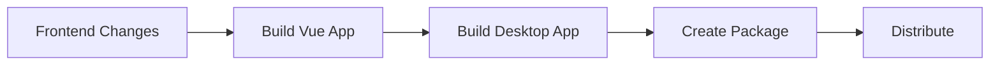

# 🏗️ Desktop Application Build Guide

## 📋 Overview

This guide explains how to build the CTR Mapper desktop application whenever you make changes to the frontend (Vue.js) or backend (Python) components.

## 🔄 Build Process Workflow



---

## 🚀 Quick Build Commands

### **For Frontend Changes Only**

```bash
# 1. Navigate to frontend directory
cd webapp/frontend-vue

# 2. Build the Vue.js frontend
npm run build

# 3. Build the desktop application
cd ../
python build_desktop.py
```

### **For Backend Changes Only**

```bash
# Navigate to webapp directory
cd webapp

# Build the desktop application
python build_desktop.py
```

---

## 📖 Step-by-Step Instructions

### **Step 1: Prepare Your Environment**

Ensure you have the required tools installed:

```bash
# Check Node.js and npm
node --version  # Should be 16+ 
npm --version   # Should be 8+

# Check Python
python --version  # Should be 3.8+

# Install PyInstaller if needed
pip install pyinstaller
```

### **Step 2: Build Frontend (Vue.js)**

When you make changes to any Vue component:

```bash
# Navigate to the frontend directory
cd /mnt/c/workarea/ctr_mapper/webapp/frontend-vue

# Install dependencies (if first time or package.json changed)
npm install

# Build the production version
npm run build
```

**✅ Expected Output:**
- Creates `/webapp/frontend-dist/` folder
- Contains all compiled Vue.js assets
- Optimized for production

### **Step 3: Build Desktop Application**

```bash
# Navigate back to webapp root
cd /mnt/c/workarea/ctr_mapper/webapp

# Run the desktop build script
python build_desktop.py
```

**✅ Expected Output:**
```
============================================================
CTR Mapper Desktop Build Script (Combined Version)
============================================================
Cleaning previous build artifacts...
✓ Frontend built successfully
Creating executable with PyInstaller...
✓ Executable created successfully!
Creating installer package...
✓ Package created in CTR_Mapper_Desktop_Package/
============================================================
✓ Build completed successfully!
✓ Executable: dist/CTR_Mapper/
✓ Package: CTR_Mapper_Desktop_Package/
============================================================
```

### **Step 4: Test the Build**

```bash
# Test the desktop application
cd webapp/backend
python app.py --desktop

# Or test the executable directly
cd webapp/backend/CTR_Mapper_Desktop_Package/CTR_Mapper
./CTR_Mapper.exe
```

---

## 📁 Build Output Structure

After building, you'll have:

```
webapp/backend/
├── dist/
│   └── CTR_Mapper/                    # Raw PyInstaller output
│       ├── CTR_Mapper.exe            # Main executable
│       └── _internal/                 # Dependencies
├── CTR_Mapper_Desktop_Package/        # Distribution package
│   ├── CTR_Mapper/                   # Same as dist/CTR_Mapper
│   └── README.txt                    # Installation instructions
└── build/                            # Temporary build files
```

---

## 🔧 Build Script Configuration

The build script (`build_desktop.py`) automatically:

1. **Cleans** previous builds
2. **Checks** if frontend is built (runs `npm run build` if needed)
3. **Creates** executable with PyInstaller
4. **Packages** for distribution
5. **Includes** all necessary dependencies

### **Key PyInstaller Options Used:**

```python
cmd = [
    'pyinstaller',
    '--onedir',                         # Directory distribution
    '--console',                        # Show console (for debugging)
    '--name=CTR_Mapper',               # Executable name
    '--add-data=../frontend-dist;frontend-dist',  # Include Vue build
    '--add-data=services;services',     # Backend services
    '--add-data=models;models',         # Data models
    '--hidden-import=pandas,openpyxl,numpy',  # Required libraries
    '--collect-all=fastapi,uvicorn',    # Web framework
    'app.py',                          # Main entry point
    '--desktop'                        # Desktop mode flag
]
```

---

## 🚨 Common Issues & Solutions

### **Issue 1: Frontend Not Built**
**Error:** `Frontend not built. Building now...`
**Solution:** 
```bash
cd webapp/frontend-vue
npm install
npm run build
```

### **Issue 2: PyInstaller Not Found**
**Error:** `PyInstaller not found`
**Solution:**
```bash
pip install pyinstaller
```

### **Issue 3: Missing Dependencies**
**Error:** `ModuleNotFoundError` when running executable
**Solution:** Add to build script:
```python
'--hidden-import=missing_module_name'
```

### **Issue 4: Large Executable Size**
**Solution:** Use `--exclude-module` for unused packages:
```python
'--exclude-module=matplotlib',
'--exclude-module=scipy'
```

### **Issue 5: Antivirus Blocking Executable**
**Solution:** 
- Add exception in antivirus software
- Consider code signing for production

---

## 🏃‍♂️ Quick Development Workflow

### **For Rapid Frontend Changes:**

```bash
# 1. Make your Vue.js changes
# 2. Hot reload during development
cd webapp/frontend-vue
npm run dev

# 3. When satisfied, build for desktop
npm run build
cd ../
python build_desktop.py

# 4. Test desktop build
cd backend/CTR_Mapper_Desktop_Package/CTR_Mapper
./CTR_Mapper.exe
```

### **For Backend Changes:**

```bash
# 1. Make Python changes in webapp/backend/
# 2. Test with development server
cd webapp/backend
python app.py --desktop

# 3. Build desktop when ready
cd ../
python build_desktop.py
```

---

## 📦 Distribution

### **For Internal Distribution:**

```bash
# Create ZIP file
cd webapp/backend
zip -r CTR_Mapper_Desktop_v1.0.zip CTR_Mapper_Desktop_Package/
```

### **For Production Distribution:**

1. **Code Sign** the executable (Windows)
2. **Create MSI installer** using WiX or NSIS
3. **Setup auto-updater** mechanism
4. **Include certificate** verification

---

## 🔍 Debugging Build Issues

### **Enable Verbose Output:**
```bash
# Add to PyInstaller command
--debug=all
```

### **Check Dependencies:**
```bash
# Analyze what's missing
python -m pip list
python -c "import pandas, openpyxl, fastapi; print('All imports OK')"
```

### **Test Individual Components:**
```bash
# Test backend only
cd webapp/backend
python app.py --desktop

# Test frontend only
cd webapp/frontend-vue
npm run serve
```

---

## 📊 Build Performance

| Component | Build Time | Size |
|-----------|------------|------|
| Vue.js Frontend | ~30s | ~2MB |
| Python Backend | ~2-5min | ~100MB |
| Total Package | ~3-6min | ~102MB |

---

## 🎯 Best Practices

1. **Always build frontend first** before desktop build
2. **Test both development and built versions**
3. **Keep build logs** for debugging
4. **Version your builds** with git tags
5. **Test on clean Windows VM** before distribution
6. **Monitor executable size** to avoid bloat
7. **Use virtual environments** to ensure clean dependencies

---

## 🔄 Automation Options

### **GitHub Actions Workflow:**
```yaml
name: Build Desktop App
on: [push, pull_request]
jobs:
  build:
    runs-on: windows-latest
    steps:
    - uses: actions/checkout@v3
    - uses: actions/setup-node@v3
      with:
        node-version: '18'
    - uses: actions/setup-python@v4
      with:
        python-version: '3.11'
    - run: |
        cd webapp/frontend-vue
        npm install
        npm run build
        cd ../
        pip install -r requirements.txt
        pip install pyinstaller
        python build_desktop.py
```

### **Local Batch Script (Windows):**
```batch
@echo off
echo Building CTR Mapper Desktop Application...
cd webapp\frontend-vue
call npm run build
cd ..\
python build_desktop.py
echo Build complete!
pause
```

---

## 📝 Notes

- Build process is optimized for Windows primarily
- Cross-platform builds require platform-specific runners
- Consider Docker for consistent build environments
- Monitor dependency licenses for commercial use
- Regular security updates for included libraries

**Last Updated:** 2025-01-21  
**Build Script Version:** 1.0  
**Compatible With:** Python 3.8+, Node.js 16+